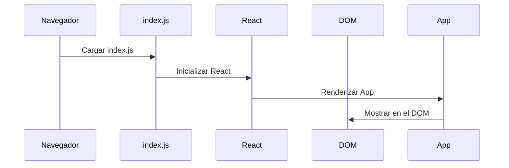

# Chapter 1: Punto de Entrada


Bienvenido al primer capítulo de nuestro tutorial sobre `administradorbasicodecitas`. En este capítulo, exploraremos el concepto de "Punto de Entrada", que es fundamental para entender cómo se inicia nuestra aplicación.

## Motivación

Imagina que estás construyendo una casa. La puerta principal es crucial, ya que es la entrada que te lleva al interior. De manera similar, el punto de entrada en una aplicación es el archivo que inicia todo y permite que los usuarios vean nuestra aplicación en el navegador. Sin este archivo, no podríamos ejecutar nuestra aplicación.

### Caso de Uso

Supongamos que queremos mostrar una aplicación sencilla que gestione citas. Necesitamos un lugar donde comience todo, donde se inicialice la aplicación y se muestre el contenido en el navegador. Aquí es donde entra el "Punto de Entrada".

## Conceptos Clave

1. **Componente Principal**: Es el componente que se renderiza en la pantalla. En nuestro caso, se llama `App`.
2. **Renderizado**: Es el proceso de mostrar nuestro componente en el navegador.
3. **Módulos de React**: Utilizamos `React` y `ReactDOM` para construir y mostrar nuestra aplicación.

### Usando el Punto de Entrada

El archivo que actúa como nuestro punto de entrada se llama `index.js`. A continuación, veremos cómo se ve este archivo.

```javascript
import React from 'react'; // Importamos React
import ReactDOM from 'react-dom'; // Importamos ReactDOM
import './index.css'; // Importamos los estilos
import App from './App'; // Importamos el componente principal
import reportWebVitals from './reportWebVitals'; // Importamos métricas de rendimiento

// Se inicia el renderizado
ReactDOM.render(
  <React.StrictMode>
    <App /> // Renderizamos el componente App
  </React.StrictMode>,
  document.getElementById('root') // Donde se mostrará en el DOM
);

// Si deseas medir el rendimiento, puedes pasar una función
reportWebVitals();
```

En este código, estamos haciendo varias cosas:

- **Importaciones**: Traemos las bibliotecas y los archivos necesarios.
- **Renderizado**: Usamos `ReactDOM.render` para mostrar nuestro componente `App`.
- **Elemento raíz**: Especificamos que queremos renderizar en un elemento del DOM con el id `root`.

## Implementación Interna

Cuando ejecutamos nuestra aplicación, estos son los pasos que ocurren:

1. El navegador carga el archivo `index.js`.
2. React inicia y busca el componente `App`.
3. El componente `App` se renderiza en el elemento con el id `root`.

Para visualizar esto, podemos usar un diagrama de secuencia simple:



### Detalles del Código

El archivo `index.js` es bastante simple. Aquí hay un desglose de su contenido:

- **Importaciones**: Traemos las librerías necesarias para usar React y renderizar componentes.
- **React.StrictMode**: Es una herramienta para detectar problemas en la aplicación.
- **document.getElementById('root')**: Este método encuentra el lugar en el HTML donde queremos mostrar nuestra aplicación.

## Conclusión

En este capítulo, aprendimos sobre el "Punto de Entrada" de nuestra aplicación `administradorbasicodecitas`. Vimos cómo se inicializa y renderiza el componente principal, que es esencial para que nuestra aplicación funcione correctamente. Ahora estamos listos para avanzar al siguiente capítulo, donde exploraremos el [Administrador de Citas](02_administrador_de_citas_.md). ¡Nos vemos allí!

---

Generated by [AI Codebase Knowledge Builder](https://github.com/The-Pocket/Tutorial-Codebase-Knowledge)