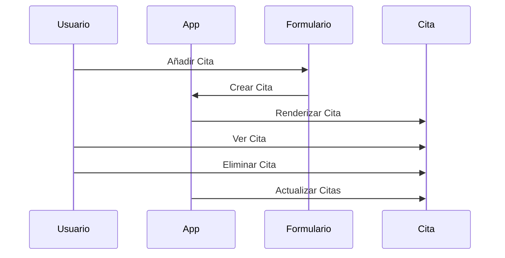

# Chapter 2: Administrador de Citas


En el capítulo anterior, hablamos sobre el [Punto de Entrada](01_punto_de_entrada_.md) de nuestra aplicación `administradorbasicodecitas`. Ahora, nos adentraremos en el concepto del "Administrador de Citas". Este componente es fundamental para la gestión de todas las citas en nuestra aplicación.

## Motivación

Imagina que eres el encargado de organizar un consultorio médico. Tu trabajo es asegurarte de que todas las citas estén bien registradas, que se puedan agregar nuevas citas y que se eliminen las que ya no son necesarias. El "Administrador de Citas" es el componente que te ayuda a hacer esto de manera efectiva, funcionando como un organizador que mantiene todo en orden.

### Caso de Uso

Supongamos que queremos crear una aplicación sencilla donde los usuarios puedan añadir, ver y eliminar citas. Necesitamos un lugar donde se gestionen todas estas acciones de manera eficiente. Aquí es donde entra el "Administrador de Citas".

## Conceptos Clave

1. **Arreglo de Citas**: Es una lista donde se almacenan todas las citas actuales.
2. **Crear Cita**: Es la función que permite añadir una nueva cita al arreglo.
3. **Eliminar Cita**: Es la función que elimina una cita existente del arreglo.
4. **Renderizar Citas**: Es el proceso de mostrar las citas en la interfaz de usuario.

### Usando el Administrador de Citas

Vamos a ver cómo podemos implementar el "Administrador de Citas" en nuestro código. Comenzaremos con el archivo `src/App.js`, que ya tiene una estructura básica.

```javascript
import { Fragment, useState, useEffect } from 'react'; // Importamos los hooks de React
import Formulario from './componentes/Formulario/Formulario'; // Componente para crear citas
import Cita from './componentes/Cita/Cita'; // Componente para mostrar citas

function App() {
  // Arreglo de citas
  const [citas, setCitas] = useState([]); // Inicializamos un estado vacío para las citas

  // Función para crear una nueva cita
  const crearCita = (cita) => {
    setCitas([...citas, cita]); // Añadimos la nueva cita al arreglo
  };

  // Función para eliminar una cita
  const eliminarCita = (citaAEliminar) => {
    const agendaPostEliminación = citas.filter(cita => cita.id !== citaAEliminar); // Filtramos las citas
    setCitas(agendaPostEliminación); // Actualizamos el estado con las citas filtradas
  };

  return (
    <Fragment>
      <h1>Administrador Básico de Citas</h1>
      <Formulario crearCita={crearCita} /> {/* Componente para añadir citas */}
      {citas.map(cita => (
        <Cita key={cita.id} cita={cita} eliminarCita={eliminarCita} /> // Mostramos cada cita
      ))}
    </Fragment>
  );
}

export default App;
```

En este código hemos realizado varias acciones:

- **Importaciones**: Traemos los componentes necesarios para gestionar citas.
- **useState**: Usamos este hook para manejar el estado de las citas.
- **crearCita**: Esta función añade una nueva cita al array de citas.
- **eliminarCita**: Esta función elimina una cita del array.

### Implementación Interna

Cuando ejecutamos nuestra aplicación y el "Administrador de Citas" es llamado, esto es lo que sucede paso a paso:

1. El componente `App` se inicializa y se crea un estado vacío para las citas.
2. Cuando se añade una nueva cita, se llama a `crearCita` y se actualiza el estado.
3. Al eliminar una cita, se llama a `eliminarCita`, filtrando las citas existentes.
4. Finalmente, las citas se renderizan en la interfaz de usuario.

Para visualizar esto, aquí hay un diagrama de secuencia simple:



### Detalles del Código Interno

Ahora, veamos un poco más de cerca cómo funciona el código en `src/App.js`.

```javascript
const [citas, setCitas] = useState([]); // Inicializamos el estado de citas

const crearCita = (cita) => {
  setCitas([...citas, cita]); // Añadimos la nueva cita
};
```

- **useState**: Aquí inicializamos el estado de `citas` como un array vacío. Esto nos permite almacenar todas las citas.
- **crearCita**: Esta función toma un objeto de cita y lo añade al array de citas existente. Usamos el operador de propagación (`...`) para incluir todas las citas previas junto con la nueva.

### Conclusión

En este capítulo, aprendimos sobre el "Administrador de Citas" y cómo se encarga de gestionar las citas en nuestra aplicación. Vimos cómo crear y eliminar citas, así como cómo mostrarlas en la interfaz de usuario. Esto es clave para que nuestra aplicación funcione correctamente. Ahora estamos listos para avanzar al siguiente capítulo, donde exploraremos el [Formulario de Citas](03_formulario_de_citas_.md). ¡Nos vemos allí!

---

Generated by [AI Codebase Knowledge Builder](https://github.com/The-Pocket/Tutorial-Codebase-Knowledge)