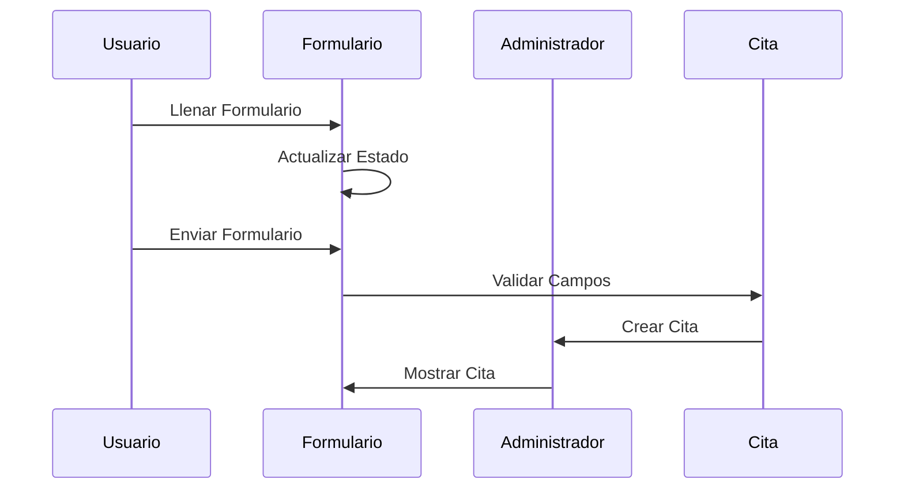

# Chapter 3: Formulario de Citas


En el capítulo anterior, exploramos el concepto de [Administrador de Citas](02_administrador_de_citas_.md), que se encarga de gestionar todas las citas en nuestra aplicación `administradorbasicodecitas`. Ahora, nos enfocaremos en el "Formulario de Citas", un componente esencial que permite a los usuarios agregar nuevas citas de manera sencilla y organizada.

## Motivación

Imagina que eres un veterinario que necesita registrar las citas de los pacientes. Cada vez que un dueño de mascota quiere hacer una cita, necesita un formulario donde pueda ingresar los detalles importantes, como el nombre de la mascota, la fecha y los síntomas. El "Formulario de Citas" es como una hoja de entrada que hace posible que los usuarios ingresen toda la información necesaria para crear una cita.

### Caso de Uso

Supongamos que tenemos una aplicación para gestionar citas en un consultorio veterinario. Los usuarios deben poder ingresar la información de sus mascotas para crear una cita. Necesitamos un formulario que recoja estos datos y los envíe al "Administrador de Citas". Aquí es donde entra en juego el "Formulario de Citas".

## Conceptos Clave

1. **Estado de la Cita**: Es donde almacenamos la información ingresada por el usuario en el formulario.
2. **Manejo de Eventos**: Es el proceso de detectar cuando el usuario ingresa datos o envía el formulario.
3. **Validación**: Es la comprobación de que todos los campos requeridos estén completos antes de enviar el formulario.
4. **ID Único**: Cada cita necesita un identificador único para poder gestionarla más tarde.

### Usando el Formulario de Citas

A continuación, veremos cómo implementar el "Formulario de Citas" en nuestro código. Comenzaremos con el archivo `src/componentes/Formulario/Formulario.jsx`.

```javascript
import React, { Fragment, useState } from 'react'; // Importamos React y useState
import { nanoid } from 'nanoid'; // Importamos nanoid para generar IDs únicos
import PropTypes from 'prop-types'; // Importamos PropTypes para validar propiedades

// Componente funcional para el formulario
const Formulario = ({ crearCita }) => {
  // Crear estado para la cita
  const [cita, setCita] = useState({
    mascota: '',
    propietario: '',
    fecha: '',
    hora: '',
    sintomas: '',
  });

  const [error, setError] = useState(false); // Estado para manejar errores

  // Función que se ejecuta cuando el usuario escribe en un input
  const actualizarState = (e) => {
    setCita({
      ...cita, // Mantenemos los otros valores
      [e.target.name]: e.target.value, // Actualizamos el campo específico
    });
  };

  // Función que se ejecuta al enviar el formulario
  const enviarCita = (e) => {
    e.preventDefault(); // Prevenimos el comportamiento por defecto del formulario

    // Validar que todos los campos estén llenos
    if (
      cita.mascota.trim() === '' ||
      cita.propietario.trim() === '' ||
      cita.fecha.trim() === '' ||
      cita.hora.trim() === '' ||
      cita.sintomas.trim() === ''
    ) {
      setError(true); // Si hay error, actualizamos el estado
      return;
    }

    // Si no hay error, creamos un ID único para la cita
    cita.id = nanoid();
    crearCita(cita); // Llamamos a la función para crear la cita

    // Reiniciar el formulario
    setCita({
      mascota: '',
      propietario: '',
      fecha: '',
      hora: '',
      sintomas: '',
    });
  };

  return (
    <Fragment>
      <h2>Crear Cita</h2>
      {error ? <p className='alerta-error'>Todos los campos son obligatorios</p> : null}
      <form onSubmit={enviarCita}>
        <label>Nombre de la Mascota</label>
        <input type='text' name='mascota' onChange={actualizarState} value={cita.mascota} />
        <label>Nombre del Dueño</label>
        <input type='text' name='propietario' onChange={actualizarState} value={cita.propietario} />
        <label>Fecha</label>
        <input type='date' name='fecha' onChange={actualizarState} value={cita.fecha} />
        <label>Hora</label>
        <input type='time' name='hora' onChange={actualizarState} value={cita.hora} />
        <label>Síntomas Presentados por la Mascota</label>
        <textarea name='sintomas' onChange={actualizarState} value={cita.sintomas}></textarea>
        <button type='submit'>Agregar Cita</button>
      </form>
    </Fragment>
  );
};

Formulario.propTypes = {
  crearCita: PropTypes.func.isRequired, // Validamos que crearCita sea una función
};

export default Formulario; // Exportamos el componente
```

En este código, hemos realizado varias acciones:

- **Importaciones**: Traemos React, `useState`, `nanoid` y `PropTypes`.
- **Estado de la Cita**: Inicializamos un estado para almacenar la información de la cita.
- **Manejo de Eventos**: La función `actualizarState` actualiza el estado de la cita conforme el usuario escribe.
- **Validación**: La función `enviarCita` valida que todos los campos estén llenos antes de crear la cita.

### Implementación Interna

Cuando el "Formulario de Citas" es utilizado, esto es lo que sucede paso a paso:

1. El usuario abre el formulario y comienza a llenar los campos.
2. Cada vez que el usuario escribe, se llama a `actualizarState`, que actualiza el estado de la cita.
3. Cuando el usuario envía el formulario, se llama a `enviarCita`.
4. La función valida los campos; si todo está bien, genera un ID único para la cita y llama a `crearCita` para añadirla al estado del administrador de citas.
5. Finalmente, el formulario se reinicia, permitiendo al usuario ingresar otra cita si lo desea.

Para visualizar esto, podemos usar un diagrama de secuencia simple:



### Detalles del Código Interno

Veamos un poco más de cerca cómo funciona el código en `src/componentes/Formulario/Formulario.jsx`.

```javascript
const [cita, setCita] = useState({
  mascota: '',
  propietario: '',
  fecha: '',
  hora: '',
  sintomas: '',
});
```

- **useState**: Aquí inicializamos el estado de `cita` como un objeto con campos vacíos. Esto nos permite almacenar la información ingresada por el usuario.

```javascript
const enviarCita = (e) => {
  e.preventDefault(); // Prevenimos el comportamiento por defecto
  if (cita.mascota.trim() === '') {
    setError(true); // Activamos el error si falta información
    return;
  }
  cita.id = nanoid(); // Generamos un ID único
  crearCita(cita); // Llamamos a la función que agrega la cita
};
```

- **enviarCita**: Esta función se encarga de validar los campos y de crear una nueva cita. Si se detecta un campo vacío, se muestra un mensaje de error.

### Conclusión

En este capítulo, aprendimos sobre el "Formulario de Citas" y cómo permite a los usuarios ingresar información para crear nuevas citas en nuestra aplicación `administradorbasicodecitas`. Vimos cómo manejar el estado, validar datos y crear citas. Ahora estamos listos para avanzar al siguiente capítulo, donde exploraremos el [Cita](04_cita_.md). ¡Nos vemos allí!

---

Generated by [AI Codebase Knowledge Builder](https://github.com/The-Pocket/Tutorial-Codebase-Knowledge)