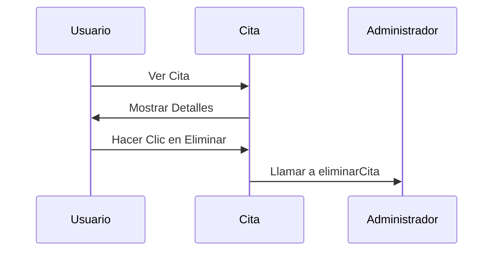

# Chapter 4: Cita


En el capítulo anterior, exploramos el concepto del [Formulario de Citas](03_formulario_de_citas_.md), donde los usuarios pueden ingresar la información necesaria para crear una cita. Ahora, nos enfocaremos en el componente "Cita", que representa cada cita individual en nuestra aplicación `administradorbasicodecitas`.

## Motivación

Imagina que tienes un consultorio veterinario y necesitas llevar un registro de todas las citas de las mascotas. Cada cita incluye información importante como el nombre de la mascota, el propietario, la fecha y los síntomas. El componente "Cita" actúa como un archivo que organiza y muestra toda esta información de manera clara y ordenada. Esto permite que tanto los veterinarios como los dueños de mascotas tengan acceso fácil a los detalles de cada cita.

### Caso de Uso

Supongamos que un dueño de mascota quiere revisar la cita de su animal. Necesitamos un componente que muestre de manera clara todos los detalles de la cita, así como la opción de eliminarla si ya no es necesaria. Aquí es donde entra en juego el componente "Cita".

## Conceptos Clave

1. **Propiedades (Props)**: Son datos que se pasan de un componente padre a un componente hijo. En este caso, pasaremos la información de la cita y la función para eliminarla.
2. **Renderizado**: Es el proceso de mostrar el componente en la interfaz de usuario. Necesitamos asegurarnos de que la información de cada cita se muestre correctamente.
3. **Eventos**: Son acciones que el usuario puede realizar, como hacer clic en un botón para eliminar una cita.

### Usando el Componente Cita

Veamos cómo implementar el componente "Cita". Comenzaremos con el archivo `src/componentes/Cita/Cita.jsx`.

```javascript
// Importamos React y PropTypes
import React from 'react';
import PropTypes from 'prop-types';

// Componente funcional para mostrar una cita
const Cita = ({ cita, eliminarCita }) => (
  <div className='cita'>
    <p>
      Mascota: <span>{cita.mascota}</span>
    </p>
    <p>
      Propietario: <span>{cita.propietario}</span>
    </p>
    <p>
      Fecha: <span>{cita.fecha}</span>
    </p>
    <p>
      Hora: <span>{cita.hora}</span>
    </p>
    <p>
      Síntomas: <span>{cita.sintomas}</span>
    </p>

    <button
      className='button eliminar u-full-width'
      onClick={() => eliminarCita(cita.id)}>
      Eliminar &times;
    </button>
  </div>
);

// Definimos las propiedades que acepta el componente
Cita.propTypes = {
  cita: PropTypes.object.isRequired,
  eliminarCita: PropTypes.func.isRequired,
};

// Exportamos el componente
export default Cita;
```

En este código:

- **Importaciones**: Traemos React y PropTypes para gestionar propiedades.
- **Componente Cita**: Este componente recibe las propiedades `cita` y `eliminarCita`. Muestra la información de la cita y un botón para eliminarla.
- **PropTypes**: Aseguramos que `cita` sea un objeto y `eliminarCita` sea una función.

### Implementación Interna

Cuando se utiliza el componente "Cita", esto es lo que sucede paso a paso:

1. El componente recibe la información de la cita y la función para eliminarla como propiedades.
2. El componente renderiza la información de la cita en la interfaz de usuario, mostrando los detalles como el nombre de la mascota, el propietario, la fecha, etc.
3. Cuando el usuario hace clic en el botón "Eliminar", se llama a la función `eliminarCita`, pasando el ID de la cita que debe eliminarse.

Para visualizar esto, aquí hay un diagrama de secuencia simple:



### Detalles del Código Interno

Veamos un poco más de cerca cómo funciona el código en `src/componentes/Cita/Cita.jsx`.

```javascript
const Cita = ({ cita, eliminarCita }) => (
  <div className='cita'>
    <p>Mascota: <span>{cita.mascota}</span></p>
    <button onClick={() => eliminarCita(cita.id)}>Eliminar</button>
  </div>
);
```

- **Props**: El componente recibe `cita` y `eliminarCita` como propiedades. Esto permite que el componente sea reutilizable con diferentes citas.
- **Renderizado**: Se muestra la información de la mascota. Cuando se hace clic en "Eliminar", se ejecuta la función `eliminarCita` con el ID de la cita.

### Conclusión

En este capítulo, aprendimos sobre el componente "Cita" y cómo representa cada cita individual en nuestra aplicación `administradorbasicodecitas`. Vimos cómo se pueden mostrar los detalles de la cita y cómo se puede eliminar una cita cuando ya no es necesaria. Esto contribuye a la gestión eficiente de citas en nuestra aplicación. Ahora estamos listos para avanzar al siguiente capítulo, donde exploraremos el [Reporte de Métricas](05_reporte_de_métricas_.md). ¡Nos vemos allí!

---

Generated by [AI Codebase Knowledge Builder](https://github.com/The-Pocket/Tutorial-Codebase-Knowledge)