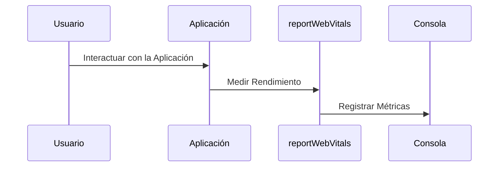

# Chapter 5: Reporte de Métricas


En el capítulo anterior, exploramos el componente [Cita](04_cita_.md), que nos ayuda a gestionar cada cita individual en nuestra aplicación `administradorbasicodecitas`. Ahora, nos adentraremos en el concepto de "Reporte de Métricas". Este componente es esencial para medir el rendimiento de la aplicación y nos permite identificar áreas que pueden mejorarse.

## Motivación

Imagina que estás conduciendo un coche y necesitas saber cuán rápido vas, cuánto combustible te queda y si hay algo mal en el motor. De manera similar, en una aplicación, es importante saber cómo está funcionando en tiempo real. El "Reporte de Métricas" actúa como un cronómetro que registra cuánto tiempo toma cada parte de la aplicación, ayudando a identificar áreas que pueden mejorarse.

### Caso de Uso

Supongamos que tienes una aplicación que gestiona citas. Quieres asegurarte de que los usuarios no experimenten tiempos de carga largos. Al implementar un reporte de métricas, podrás ver si hay partes de tu aplicación que necesitan optimización. Esto asegurará que la experiencia del usuario sea fluida y agradable.

## Conceptos Clave

1. **Métricas de Rendimiento**: Datos que nos indican cuánto tiempo tarda nuestra aplicación en realizar tareas específicas.
2. **Función reportWebVitals**: Una función que se utiliza para medir el rendimiento de la aplicación y registrar las métricas.
3. **Interacción con el DOM**: Cómo nuestra aplicación se comunica con el documento HTML para mostrar información.

### Usando el Reporte de Métricas

Para implementar el "Reporte de Métricas", primero necesitamos entender cómo usar la función `reportWebVitals`. Esta función se encarga de medir el rendimiento de nuestra aplicación. Vamos a ver cómo se puede configurar en el archivo `index.js`.

```javascript
// Importamos la función reportWebVitals
import reportWebVitals from './reportWebVitals'; 

// Se inicia el renderizado
ReactDOM.render(
  <React.StrictMode>
    <App />
  </React.StrictMode>,
  document.getElementById('root')
);

// Llamamos a reportWebVitals para registrar métricas de rendimiento
reportWebVitals(console.log);
```

En este fragmento de código:

- **Importaciones**: Traemos la función `reportWebVitals` para medir el rendimiento.
- **Llamada a reportWebVitals**: Al final del renderizado de nuestra aplicación, llamamos a esta función y le pasamos `console.log` para que nos muestre los resultados en la consola.

### Implementación Interna

Cuando se llama a `reportWebVitals`, esto es lo que sucede paso a paso:

1. La función se ejecuta después de que la aplicación se ha renderizado en el navegador.
2. Se envían solicitudes para medir diferentes métricas como el tiempo de carga, la interacción del usuario, etc.
3. Los resultados se registran en la consola (o donde quieras que se envíen).

Para visualizar esto, aquí hay un diagrama de secuencia simple:



### Detalles del Código Interno

Veamos cómo funciona la función `reportWebVitals` en el archivo `src/reportWebVitals.js`.

```javascript
const reportWebVitals = onPerfEntry => {
  if (onPerfEntry && onPerfEntry instanceof Function) {
    import('web-vitals').then(({ getCLS, getFID, getFCP, getLCP, getTTFB }) => {
      getCLS(onPerfEntry); // Mide el Cumulative Layout Shift
      getFID(onPerfEntry); // Mide el First Input Delay
      getFCP(onPerfEntry); // Mide el First Contentful Paint
      getLCP(onPerfEntry); // Mide el Largest Contentful Paint
      getTTFB(onPerfEntry); // Mide el Time to First Byte
    });
  }
};

export default reportWebVitals;
```

En este código:

- **Función reportWebVitals**: Toma una función como argumento, que se ejecutará con los resultados de las métricas.
- **Importación de web-vitals**: Usamos `import` para cargar la biblioteca que nos ayuda a medir las métricas.
- **Llamadas a las métricas**: Cada métrica se mide y se pasa a `onPerfEntry`, que permite que manejes los resultados según tus necesidades.

### Conclusión

En este capítulo, aprendimos sobre el "Reporte de Métricas" y cómo nos ayuda a medir el rendimiento de nuestra aplicación `administradorbasicodecitas`. Vimos cómo implementar esta funcionalidad en nuestro código y cómo registrar métricas importantes que nos ayudarán a optimizar la experiencia del usuario. Ahora estamos listos para avanzar al siguiente capítulo, donde exploraremos los [Estilos Globales](06_estilos_globales_.md). ¡Nos vemos allí!

---

Generated by [AI Codebase Knowledge Builder](https://github.com/The-Pocket/Tutorial-Codebase-Knowledge)