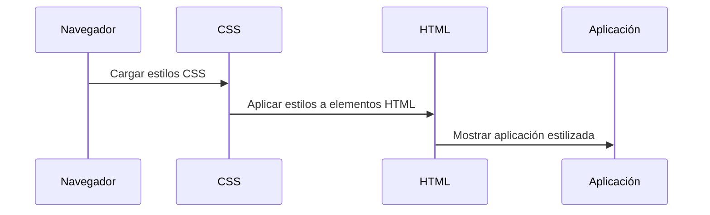

# Chapter 6: Estilos Globales


En el capítulo anterior, exploramos el [Reporte de Métricas](05_reporte_de_métricas_.md), donde aprendimos a medir el rendimiento de nuestra aplicación `administradorbasicodecitas`. Ahora, nos adentraremos en el concepto de "Estilos Globales". Este concepto es esencial para darle vida y atractivo visual a nuestra aplicación.

## Motivación

Imagina que estás organizando una fiesta. Quieres que todo se vea bien: la decoración, la iluminación y la comida. De manera similar, los "Estilos Globales" son la forma en que vestimos nuestra aplicación, haciendo que sea atractiva y fácil de usar. Sin estos estilos, la interfaz se vería desordenada y poco atractiva.

### Caso de Uso

Supongamos que queremos que nuestra aplicación de gestión de citas tenga un diseño coherente y agradable. Necesitamos un lugar donde podamos definir todos los estilos de la aplicación, como colores, fuentes y márgenes. Aquí es donde entran los "Estilos Globales".

## Conceptos Clave

1. **CSS (Cascading Style Sheets)**: Es el lenguaje utilizado para definir los estilos de una página web. Nos permite controlar cómo se ve el contenido.
2. **Selectores**: Son herramientas en CSS que nos permiten aplicar estilos a elementos específicos en nuestra aplicación.
3. **Clases y IDs**: Son atributos que podemos usar para aplicar estilos a elementos HTML de manera más específica.

### Usando los Estilos Globales

Para implementar los "Estilos Globales", comenzaremos con el archivo `src/index.css`, donde definiremos nuestros estilos básicos. Aquí hay un ejemplo de cómo podría verse:

```css
/* Estilos Globales */
html {
  min-height: 100%; /* Asegura que el html ocupe toda la altura */
}

body {
  margin: 0; /* Elimina el margen por defecto */
  padding: 0; /* Elimina el padding por defecto */
  font-family: sans-serif; /* Define la fuente de la aplicación */
  background-image: linear-gradient(-135deg, #00f7ff 0%, #056fe7 52%, #000000 100%); /* Fondo degradado */
  min-height: 100%; /* Asegura que el body ocupe toda la altura */
  padding-bottom: 5rem; /* Espacio en la parte inferior */
}

h1, h2 {
  color: white; /* Color del texto de los encabezados */
  padding: 3rem 0; /* Espaciado vertical */
  text-align: center; /* Centra el texto */
  text-transform: uppercase; /* Convierte el texto a mayúsculas */
  font-family: 'Staatliches', cursive; /* Fuente personalizada */
  letter-spacing: 1px; /* Espaciado entre letras */
}
```

En este código, hemos definido algunos estilos globales:

- **html** y **body**: Aseguramos que el documento ocupe toda la altura de la pantalla y eliminamos márgenes y paddings predeterminados.
- **h1** y **h2**: Establecemos el color, el espaciado y la alineación de los encabezados.

### Implementación Interna

Cuando aplicamos los estilos globales, estos se cargan al inicio de nuestra aplicación y se aplican a todos los elementos HTML. Aquí hay una representación de cómo sucede esto:



1. El navegador carga los estilos CSS definidos.
2. Los estilos se aplican a los elementos HTML.
3. Finalmente, la aplicación se muestra con los estilos correspondientes.

### Detalles del Código Interno

Veamos un poco más de cerca cómo funcionan los estilos en `src/index.css`.

```css
body {
  background-image: linear-gradient(-135deg, #00f7ff 0%, #056fe7 52%, #000000 100%);
}
```

- **Fondo degradado**: Aquí estamos utilizando un degradado para el fondo de la aplicación, lo que hace que sea más atractivo visualmente.

```css
h1, h2 {
  text-align: center; /* Centra el texto de los encabezados */
}
```

- **Alineación de texto**: Centramos los encabezados para que se vean más organizados y estéticamente agradables.

### Conclusión

En este capítulo, aprendimos sobre los "Estilos Globales" y cómo nos permiten definir la apariencia visual de nuestra aplicación `administradorbasicodecitas`. Vimos cómo usar CSS para aplicar estilos coherentes a todos los elementos, mejorando la experiencia del usuario. Ahora estamos listos para avanzar al siguiente capítulo, donde exploraremos la [Configuración de Pruebas](07_configuración_de_pruebas_.md). ¡Nos vemos allí!

---

Generated by [AI Codebase Knowledge Builder](https://github.com/The-Pocket/Tutorial-Codebase-Knowledge)