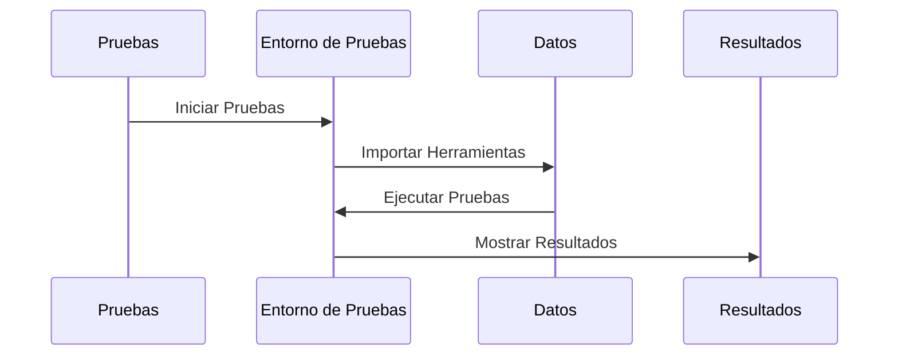

# Chapter 7: Configuración de Pruebas


En el capítulo anterior, exploramos los [Estilos Globales](06_estilos_globales_.md) y cómo estos mejoran la apariencia visual de nuestra aplicación `administradorbasicodecitas`. Ahora, nos enfocaremos en la "Configuración de Pruebas", un aspecto crucial para asegurarnos de que nuestra aplicación funcione correctamente y de que no haya errores en el código.

## Motivación

Imagina que estás construyendo una casa. Antes de mudarte, necesitas asegurarte de que todo esté en su lugar y que no haya problemas estructurales. En el desarrollo de software, las pruebas son como una inspección final. Nos ayudan a detectar errores y a garantizar que cada parte de nuestra aplicación funcione como se espera.

### Caso de Uso

Supongamos que hemos creado nuestra aplicación para gestionar citas, y ahora queremos asegurarnos de que todas las funciones, como agregar y eliminar citas, funcionen sin problemas. Aquí es donde entra la "Configuración de Pruebas". Al implementar pruebas, podemos simular el uso de nuestra aplicación y verificar que todo funcione correctamente.

## Conceptos Clave

1. **Pruebas Unitarias**: Son pruebas que verifican que una pequeña parte de nuestro código funcione correctamente de manera aislada.
2. **Jest**: Es una biblioteca de JavaScript que nos ayuda a realizar pruebas en nuestras aplicaciones.
3. **React Testing Library**: Herramienta que facilita la realización de pruebas en componentes de React.

### Usando la Configuración de Pruebas

Para implementar la "Configuración de Pruebas", comenzaremos con el archivo `src/setupTests.js`. Este archivo configura el entorno de pruebas para nuestra aplicación.

```javascript
// jest-dom añade matchers personalizados de jest para aserciones en nodos DOM.
// permite hacer cosas como:
// expect(element).toHaveTextContent(/react/i)
// aprende más: https://github.com/testing-library/jest-dom
import '@testing-library/jest-dom';
```

En este código, estamos importando `jest-dom`, que nos proporciona herramientas adicionales para facilitar nuestras aserciones en las pruebas.

### Implementación Interna

Cuando ejecutamos nuestras pruebas, esto es lo que sucede paso a paso:

1. Las pruebas se inician en un entorno controlado.
2. Se importan las herramientas necesarias, como `jest-dom`, para facilitar las aserciones.
3. Luego, se ejecutan las pruebas unitarias que hemos definido, verificando que cada componente de nuestra aplicación funcione correctamente.

Para visualizar esto, aquí hay un diagrama de secuencia simple:



### Detalles del Código Interno

Veamos un poco más de cerca cómo funciona el archivo `src/setupTests.js`.

```javascript
import '@testing-library/jest-dom'; // Importamos las herramientas de jest-dom
```

- **Importación**: Aquí estamos asegurándonos de que todas las herramientas necesarias para realizar aserciones en el DOM estén disponibles para nuestras pruebas.

### Ejemplo de Prueba

Ahora, veamos cómo escribir una prueba simple para un componente. Supongamos que tenemos un componente que muestra un mensaje.

```javascript
// Archivo: src/componentes/MiComponente.test.js
import { render, screen } from '@testing-library/react';
import MiComponente from './MiComponente';

test('muestra el mensaje correctamente', () => {
  render(<MiComponente />);
  const mensaje = screen.getByText(/hola mundo/i);
  expect(mensaje).toBeInTheDocument(); // Verificamos que el mensaje esté en el documento
});
```

En este código:

- **Importaciones**: Traemos las funciones necesarias para renderizar el componente y buscar elementos en el DOM.
- **Prueba**: Usamos `test` para definir una prueba que verifica si el componente muestra el mensaje "hola mundo".

### Conclusión

En este capítulo, aprendimos sobre la "Configuración de Pruebas" y cómo nos ayuda a garantizar que nuestra aplicación `administradorbasicodecitas` funcione correctamente. Vimos cómo configurar nuestro entorno de pruebas y cómo escribir pruebas simples para verificar el comportamiento de nuestros componentes. Esto es fundamental para mantener la calidad del código a medida que nuestra aplicación crece.

Ahora estamos listos para avanzar al siguiente capítulo, donde exploraremos el [Administrador de Citas](02_administrador_de_citas_.md). ¡Nos vemos allí!

---

Generated by [AI Codebase Knowledge Builder](https://github.com/The-Pocket/Tutorial-Codebase-Knowledge)