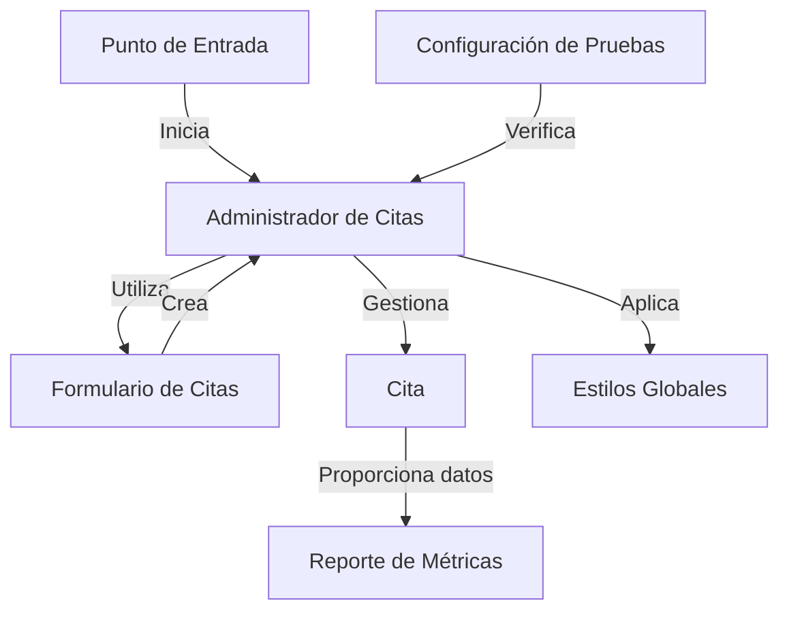

# Tutorial: administradorbasicodecitas

**Administrador Básico de Citas** es una aplicación diseñada para gestionar citas de mascotas de manera sencilla y eficiente. Permite a los usuarios agregar, eliminar y visualizar citas, asegurando que toda la información relevante esté organizada y accesible. *Es un sistema que facilita la administración de las citas a través de un formulario intuitivo y un diseño atractivo*.

**Source Repository:** [None](None)

## Chapters

1. [Punto de Entrada
](01_punto_de_entrada_.md)
2. [Administrador de Citas
](02_administrador_de_citas_.md)
3. [Formulario de Citas
](03_formulario_de_citas_.md)
4. [Cita
](04_cita_.md)
5. [Reporte de Métricas
](05_reporte_de_métricas_.md)
6. [Estilos Globales
](06_estilos_globales_.md)
7. [Configuración de Pruebas
](07_configuración_de_pruebas_.md)

---

Generated by [AI Codebase Knowledge Builder](https://github.com/The-Pocket/Tutorial-Codebase-Knowledge)